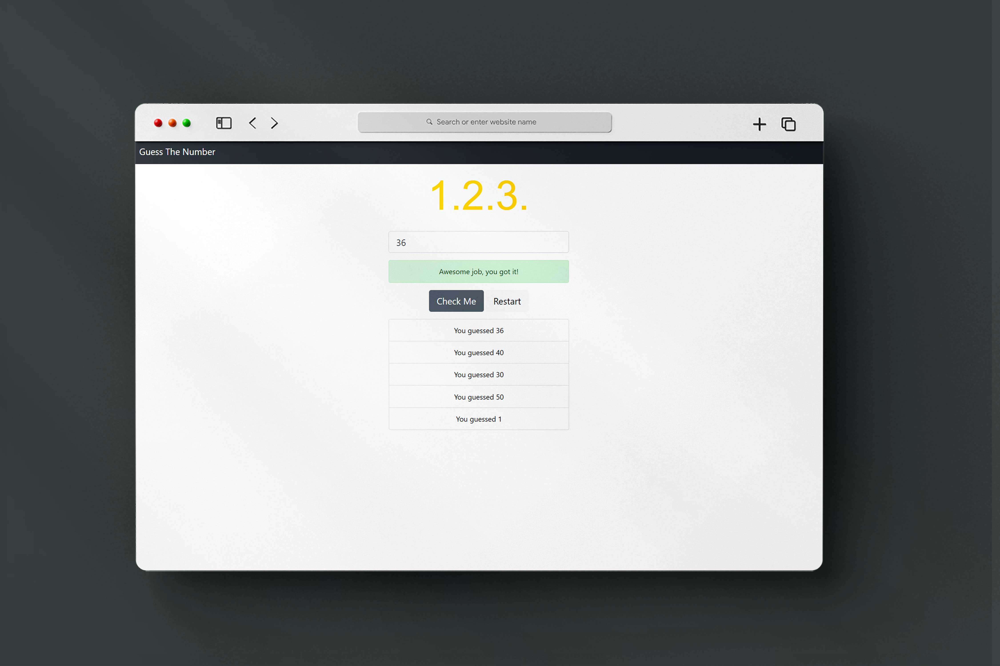

# Guess The Number Game  

Guess the secret number in the magician's hat. If your guess is too high or too low, you'll get a hint. Enter your answer.

## Deployed link of project
- <a href="https://fancy-lebkuchen-c350cc.netlify.app/">Guess The Number Game</a>

## Team Members

<ul>
  <li><a href="https://github.com/pratiksontakke">Pratik Sontakke</a> (solo project)</li>
</ul>


## Deployment

On frontend terminal perform:

```bash
  Open index.html with live server
```


## 🛠 Tech Stack

- Javascript
- HTML
- CSS

## Functionality

- Generate random numbers automatically by machine.
- Can take input from user.
- You can restart game.
- Popup message when you win.

## Website flow for User

- Enter the number.
- Get pop-up 
  - Your guess is too low!
  - Your guess is too high!
  - Awesome job, you got it!
- If want to play again click on Restart button.


#### Website Presentation :



## Thank you note
Thank you all who is giving precious time to visit our little creative project which is made with lot of efforts.

_<p align="center"><sub>- Designed by <a href="https://github.com/pratiksontakke">Pratik Sontakke</a> -</sub></p>_